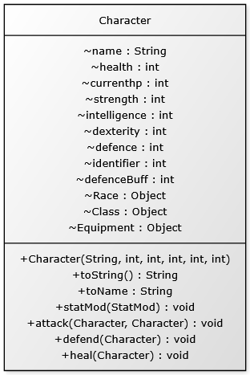
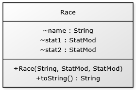

What problem your application solves
	This application aims to simulate a turn-based RPG combat. What the program will do is allow players to select a team of 3 characters each of which can have a 	different race, class, and weapon. These characters all have stats generated and having the race and class weapons allow modifications to these stats. The stats play 	a vital role in the characters as they determine a variety of factors which are described below:
	Health - determines how many points of damage a player can take before dying. 
	Strength - determines how much damage a character can do. 
	Intelligence - determines how much healing a character can do. 
	Dexterity - determines how fast a character is. Also determines the turn order of the characters.
	Defence - determines how much damage a character mitigates when being attacked. 

	The races they can chose from are:
	Human - 2x +1 stat increases.
	Orc - +2 to strength and -1 to intelligence
	Elf - +2 to dexterity and -1 to strength
	Dwarf - +2 to defence and -1 to dexterity
	Undead - +2 intelligence and -1 to defence

	The following classes with the associated weapons are:
	Paladin
		Holy Hammer - +4 defence
		Divine Doublet - +3 strength
		Flame of Faith - +3 intelligence

	Rogue
		Stealthy shoes - +4 dexterity
		Dangerous Dagger - +3 strength
		Cunning Caltrops - +2 defence

	Druid
		Faerie Flask - +10 health
		Briar Bindings - +3 defence
		Willow Whistle - +2 dexterity

	Wizard
		Crystal Cauldron - +4 intelligence
		Glowing Gemstone - +2 dexterity
		Arcane Amulet - +5 health

	Barbarian
		Rage Remedy - +10 health
		Brutal Broadaxe - +5 strength
		Savage Shield - +4 defence

	During the creation of characters, players can opt to import a class build with samples given as test0, test1 and test2. After the 3 characters have been created, the 	players can choose to export there classes to be used in future use. This will save their race, class and weapon but not their stats. Stats are randomised each time a 	player starts the game.

	Once the characters have been created, the turn-based combat starts where the 3 created characters will face 3 enemies; a Goblin, a Kobold and a Witch. The pick order 	is determined by everyone's dexterity value. 

	Once the Round has commenced. The player or enemy can chose to either attack, defend, or heal. This cycle will continue until either all 3 enemies are dead or all 3 	characters are dead in which the player will receive a "You Win!" or "You Lose!" respectively. 

A description of the structure of your program
	The program is structured into 4 different files:
	buildIO.java - the file that handles the importing/exporting character data to/from files. 
	character.java - the file that contains the data and logic for characters including races, classes and equipment
	client.java - the file that allows the game to run.
	gameLogic.java - the file that handles the core game mechanics including inputs, character creation, turn order and the battle loop. 

How to run the program
	- Ensure you have Java installed on your computer.
	- Unzip the file and note its location
	- Open the folder COMP1010_Assignment in vscode
	- if prompted, select "trust the workspace"
	- select the Client.java file and press the run button at the top.
	- The game will start in the terminal at the bottom of vscode.
	- if you wish to import builds, ensure the test0, test1, and test 2 are located at the same level as the src folder. 

Task allocation 
	Gabe 25% - 
	Jai 25% - 
	Jalib 25% - 
	Harrison 25% - Ideas for classes, stats, weapon modifiers and class weapon modifiers. Documentation and File IO.

UML Diagrams
	Class diagram
	 
	

	Sequence diagram for one turn (attacking
	Client		GameLogic		Character(attacking)		Character(defending)
	  |
	  |-- gameStart() ->|				 |				 |
	  |		    |----- battleLoop(start) --> |     				 |
	  |		    |----- att, def or heal  --->|      			 |
	  |		    |				 |--------- attack character --->|
	  |		    |				 |--------- calculate damage --->|
	  |		    |				 |<-------- update HP -----------|
	  |		    |<----- print result --------|				 |
	  |<-- next turn ---|				 |				 |
	
	State diagram
					Full Health (currenthp == health ) <---|
	  				 |                                     |
	      |-------------------------<| takeDamage (d)                      | currenthp+heal >= health
	      | (d >= currenthp)   	 v (d < currenthp)                     |
	      |			         | 				       |
	      |				 |				       ^ 
 	      |		  |------------->Wounded (0 < currenthp < health) ---->| heal h 
 	      |		  |              | takeDamage(d)               ^       v
 	      |		  |-------------<|>--------------->|           |<------| 0< currenthp+heal < health
  	      |		   (d<currenthp)   (d>= currenthp) |
	      |			                           |
	      |			                           v
	      |--------------------------------> Dead (currenthp <=0)

Analysis of two methods
	Method 1: rollStat() in GameLogic.java
		public static int[] rollStats() {
			primitive integer array created with 5 array points.
			pause game used to allow user to know they are rolling for stats.
			5 Math.random calls to create the randomised stat
			stat is then stored within each of the array points. 
			return stats.
		}

	This is simple using a primitive array to reduce memory compared to using an Arraylist whilst also minimising the time it takes to run by running only 5 Math.random 	calls.
	
	Alternative approach: ArrayList
		public static ArrayList<integer> rollStatsList() {
			Create a new integer ArrayList.
			Use a for loop to do the following:
			pauseGame to allow the user to know they are rolling for stats
			a Math.random call to roll for the stat
			add the stat to the array list
			continue for loop to loop over other stats.
			return stats.
		}
	This method allows for easier resizing if more character stats are required but a lot more memory is used to create the Integer objects and calling for the ArrayList. 
	Overall, the method in the game works much better as the character stats were predefined by us and we save more memory. 

	Method 2: 
	
	

	
